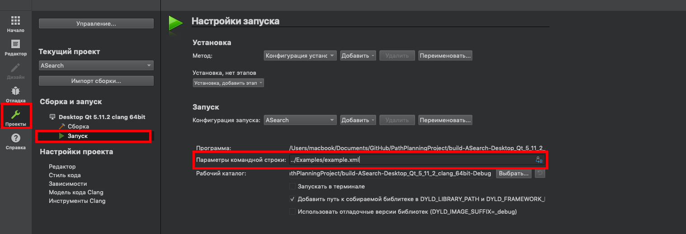

# PathFinding2019
[](https://travis-ci.org/vetand/PathFinding2019)

Этот проект позволяет находить путь между двумя точками на grid-картах, используя алгоритм Дейкстры или A*. В качестве входных данных необходимо предоставить `.xml` файл специального формата. Программа модифицирует заданный файл, дописывая туда найденный путь. Имеется поддержка большого количества опций при выборе конкретной версии алгоритма.

## Формат входного `.xml` файла

Вся информация во входном файле оборачивается в тег `root`.
Затем идёт информация о карте, которая в свою очередь оборачивается тегом `map`.
Внутри этого поля нам даны следующие данные:
+ `width`, `height` размеры карты
+ `cellsize` размер одной клетки
+ `startx`, `starty` координаты старта
+ `finishx`, `finishy` координаты финиша
+ `grid` содержит информацию о препятствиях на карте, `0` - клетка свободна, `1` - препятствие. Каждый ряд оборачивается в тег `row`.

Затем, идёт информация о требуемом алгоритме (тег `algorithm`).
+ `searchtype` выбранный алгоритм: `astar` или `dijkstra`
+ `metrictype` выбранная эвристика, где `dx`, `dy` - расстояние до финиша по осям OX и OY &mdash;
    + `euclidean` `sqrt(dx^2 + dy^2)`
    + `manhattan` `|dx| + |dy|`
    + `chebyshev` `max(|dx|, |dy|)`
    + `diagonal` расстояние, при возможности перемещаться по диагоналям без препятствий
+ `breakingties` компаратор для сравнения вершин по параметру `g`
+ `hweight` вес эвристики
+ `allowdiagonal` разрешено ли ходить по диагонали (`true`/`false`)
+ `cutcorners` разрешено ли ходить по диагонали, если рядом препятствие (аналогично)
+ `allowsqueeze` разрешено ли ходить по диагонали, если с обеих сторон препятствия (аналогично)

И, наконец, требуемые логи (`options`).
+ `loglevel` уровень логирования, каждый следующий включает всю информацию предыдущего
    + `0` ничего
    + `0.5` тег `summary` - т. е. длина пути и базовая информация о затраченных ресурсах
    + `1` путь на поле (в том числе и на grid-карте) и в формате `hppath` (точки поворота) и `lppath` (список посещённых вершин)
    + `1.5` тег `lowlevel`, в который записываются списки `OPEN` и `CLOSED` в конце работы алгоритма
    + `2` в тег `lowlevel` списки `OPEN` и `CLOSED` записываются на каждом шаге алгоритма
+ `logfilename` имя файла входных данных

Программа модифицирует файл этого формата и добавлет к нему следующие теги (по требованию).

+ `mapfilename` имя файла входных данных
+ `summary` содержит следующие параметры
    + `numberofsteps` количество итераций алгоритма (раскрытых вершин)
    + `nodecreated` количество созданных вершин (node)
    + `length` длина пути в клетках
    + `length_scaled` длина пути в единицах длины
    + `time` время работы в секундах
+ `path` grid-поле, с отмеченным на нём найденным путём
+ `lplevel` путь в формате списка тегов `node`
+ `hppath` `lplevel`, исключительно с точками поворота
+ `lowlevel` информация о работе алгоритма на уровне списков `OPEN`и `CLOSED`

## Сборка и запуск (default)

  Сборку проекта возможно осуществить двумя способами:
  - Используя QtCreator и qmake;
  - Используя CMake.

  При использовании QtCreator требуется открыть файл `ASearch.pro` который находится в директории `.../PathPlanningProject/Src/` и настроить проект с нужным комплектом сборки.

  

  После выбора проекта требуется установить имя входного файла как аргумент командной строки. В качестве первого примера используйте файл `.../PathPlanningProject/Examples/example.xml`. Для установки аргументов командной строки перейдите в настройки запуска проекта и введите нужный путь к файлу в поле "Параметры командной строки".

  

  При использовании CMake сборка и запуск может производиться как из командной строки, так и при помощи различных IDE (например JetBrains CLion). Ниже приведены скрипты сборки и запуска с использованием командной строки.

  ### Linux и Mac
  Release сборка:
  ```bash
  cd PathPlanningProject
  cd Build
  cd Release
  cmake ../../ -DCMAKE_BUILD_TYPE="Release"
  make
  make install
  ```

  Debug сборка:
  ```bash
  cd PathPlanningProject
  cd Build
  cd Debug
  cmake ../../ -DCMAKE_BUILD_TYPE="Debug"
  make
  make install
  ```

  Запуск:
  ```bash
  cd ../../Bin/{Debug|Release}/
  ./PathPlanning ../../Examples/example.xml
  ```
  ### Windows
  Release сборка:
  ```cmd
  cd PathPlanningProject
  cd Build
  cd Release
  set PATH
  cmake ../../ -DCMAKE_BUILD_TYPE="Release" -G "MinGW Makefiles"
  mingw32-make
  mingw32-make install
  ```

  Debug сборка:
  ```cmd
  cd PathPlanningProject
  cd Build
  cd Debug
  set PATH
  cmake ../../ -DCMAKE_BUILD_TYPE="Debug" -G "MinGW Makefiles"
  mingw32-make
  mingw32-make install
  ```

  Запуск:
  ```cmd
  cd ../../Bin/{Debug|Release}/
  PathPlanning.exe ../../Examples/example.xml
